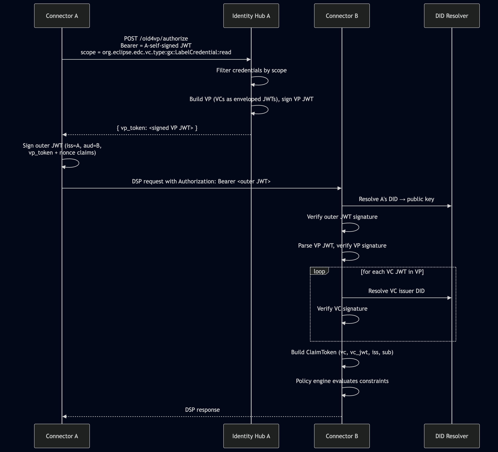
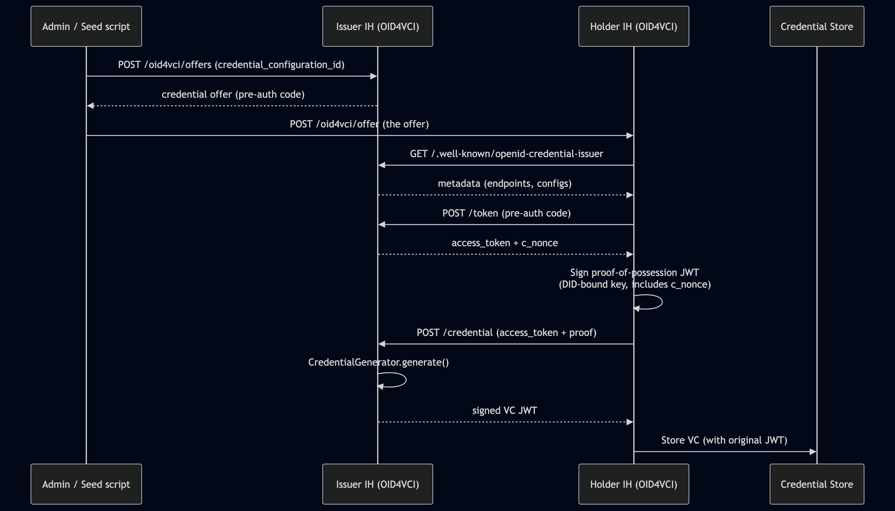
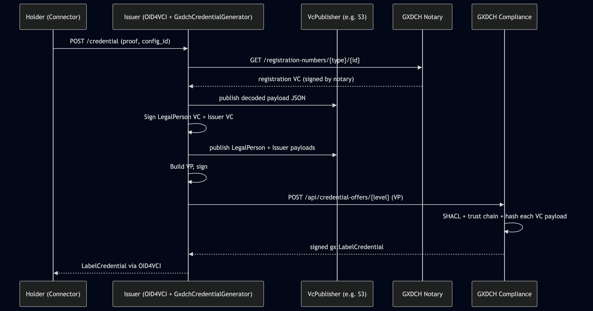

# Architecture

## Core Idea

This project replaces EDC's DCP (Decentralized Claims Protocol) with OpenID for Verifiable Presentations (OID4VP), and adds OpenID for Verifiable Credential Issuance (OID4VCI) for dynamic credential acquisition.

## Module Layout

### Connector (companion repo)

* extensions/common/iam/oid4vp/
    - oid4vp-identity-service/ # Implements EDC IdentityService via OID4VP

### IdentityHub

* protocols/oid4vp/
    - oid4vp-spi/ # Auth request/response models
    - oid4vp-core/ # Token verifier
    - oid4vp-identityhub/
        - oid4vp-presentation-api/ # POST /v1/participants/{id}/oid4vp/authorize
* protocols/oid4vci/
    - oid4vci-spi/ # CredentialGenerator interface, token store, entities
    - oid4vci-core/ # Default generator (local signing), in-memory token store
    - oid4vci-identityhub/
        - oid4vci-holder-api/ # POST /v1/participants/{id}/oid4vci/offer
        - oid4vci-issuer-api/ # /.well-known/openid-credential-issuer, /token, /credential, /offers
    - oid4vci-store-sql/ # SQL-backed token store

These modules are fully generic - they do not know about Gaia-X

### GXEDC (this repo)

* extensions/
    - gx-impl/ # Loaded by Connector
        - GaiaXCredentialValidator # Validates gx:LabelCredential (with optional basic-functions call)
        - GaiaXLabelCredentialFunction # Policy constraint: "GaiaXLabelCredential eq active"
        - GaiaXLabelLevelFunction # Policy constraint: "GaiaXLabelLevel eq SC/L1/L2/L3"
        - GaiaXPolicyExtension # Registers both functions above in catalog, negotiation and transfer scopes
    - gx-issuer/ # Loaded by Identity Hub
        - GxdchClient # HTTP client for GXDCH notary + compliance
        - GxdchCredentialGenerator # CredentialGenerator implementation proxying to GXDCH
        - GxdchIssuerExtension # Registers generator as @Provider (overrides default)
        - VcPublisher # SPI for publishing issued VCs at dereferenceable URL
        - NoopVcPublisher # Default no-op publisher when no implementation is wired
    - gx-issuer-s3/ # Loaded by Identity Hub (requires gx-issuer)
        - S3VcPublisher # Uploads VCs to S3 via AWS SDK
        - S3VcPublisherExtension # Registers publisher when bucket is configured

## DSP authentication flow (OID4VP)

Key Properties:
- **Multi-layer signature verification**: outer JWT, VP JWT, each individual VC JWT - all verified againsts DID-resolved public keys.
- **Scope-based credential selection**: the IH's presentation API filters its credential store by the scope requested in the authorization request.
- **ClaimToken contents**: after verification, the Connector's policy engine receives `vc` (parsed VCs) and `vc_jwt` (raw VC JWTs) as claims, alongside `iss` and `sub`.

## OID4VCI credential issuance flow

The `CredentialGenerator` interface has two implementations:
- **`DefaultCredentialGenerator`** (in `oid4vci-core`) self-signs a simple VC using the issuer's vault key.
- **`GxdchCredentialGenerator`** (in `gx-issuer`) - proxies to real GXDCH notary + compliance.

When `gx-issuer` is on the classpath, its `@Provider` overrides the default.

## Full Gaia-X Flow (GXDCH proxy)

When `GxdchCredentialGenerator` is active, the OID4VCI `/credential` endpoint internally performs the full Gaia-X compliance flow:

## Policy Enforcement

The Gaia-X addon provides two policy constraints, both available in Catalog, Negotiation, and Transfer scopes:

| Constraint key | Purpose | Example |
|---|---|---|
| `GaiaXLabelCredential` | Require any valid `gx:LabelCredential` | `"leftOperand": "GaiaXLabelCredential", "operator": "eq", "rightOperand": "active"` |
| `GaiaXLabelLevel` | Require a specific label level | `"leftOperand": "GaiaXLabelLevel", "operator": "eq", "rightOperand": "L2"` |

The `GaiaXCredentialValidator` performs:

1. **Type check** - VC types include `gx:LabelCredential`.
2. **Time check** - `validFrom` and `validUntil` check.
3. **Compliant credentials check** - both `gx:LegalPerson` and `gx:Issuer`, plus any one of `gx:VatID` / `gx:LeiCode` / `gx:Eori` / `gx:Euid` are referenced in `gx:compliantCredentials`.
4. **Optional remote check** - calls `gx-basic-functions` for SHACL validation and trust chain verification (configurable via `edc.gaiax.basic.functions.url`).

## Three deployment modes

| Mode | Extensions loaded | Use case |
|---|---|---|
| Pure OID4VC | none from gaiax-edc | Non-Gaia-X dataspaces |
| OID4VC + Gaia-X policy | `gx-impl` (connector) | Manual credential seeding + policy enforcement |
| Full Gaia-X | `gx-impl` (connector) + `gx-issuer` (IH) | Production Gaia-X with real GXDCH |

Switching modes = adding/removing the extension from the relevant launcher's `build.gradle.kts`.
