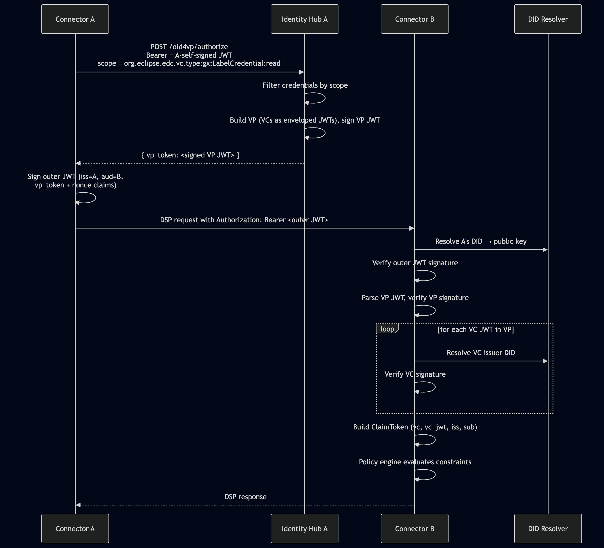
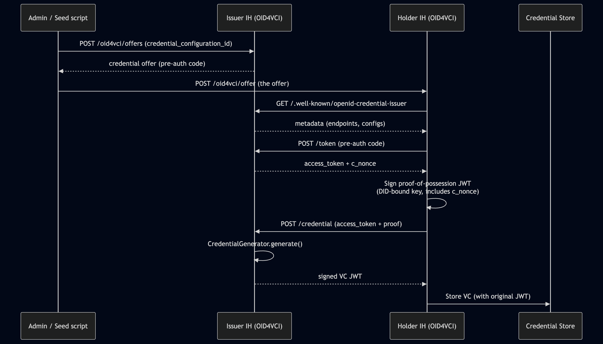

# Architecture

## Core Idea

This project replaces EDC's DCP (Decentralized Claims Protocol) with OpenID for Verifiable Presentations (OID4VP), and adds OpenID for Verifiable Credential Issuance (OID4VCI) for dynamic credential acquisition.

## Specification versions

| Spec | Version targeted | Notes |
|---|---|---|
| OpenID4VP | 1.0 (Final) | DCQL queries, `decentralized_identifier:` client id prefix, `vp_token` as JSON object, `direct_post` |
| OpenID4VCI | 1.0 (Final) | Pre-authorized code grant, nonce endpoint, `credential_configuration_id`, `credentials` array response |
| W3C VC Data Model | 2.0 | Credentials as `vc+jwt` (VC-JOSE-COSE), presentations as `vp+jwt` with `EnvelopedVerifiableCredential` |
| DID method | `did:web` | Key resolution via EDC `DidPublicKeyResolver` |

OID4VCI 1.0 defines no credential format identifier for VCDM 2.0 secured with JOSE, so this project uses the ecosystem-defined identifier `vc+jwt` (mirrors the IANA media type `application/vc+jwt`).

Note that the request transport is not a standard OID4VP flow: the Connector pushes the signed Request Object server-to-server to the Identity Hub's authorize endpoint and receives the response via `direct_post`. The messages are OID4VP-conformant; the delivery is machine-to-machine (the role DCP plays upstream).

## Module Layout

### Connector (companion repo)

* extensions/common/iam/oid4vp/
    - oid4vp-identity-service/ # Implements EDC IdentityService via OID4VP

### IdentityHub

* protocols/oid4vp/
    - oid4vp-spi/ # Auth request/response models
    - oid4vp-core/ # Token verifier
    - oid4vp-identityhub/
        - oid4vp-presentation-api/ # POST /v1/participants/{id}/oid4vp/authorize
* protocols/oid4vci/
    - oid4vci-spi/ # CredentialGenerator interface, token store, entities
    - oid4vci-core/ # Default generator (local signing), in-memory token store
    - oid4vci-identityhub/
        - oid4vci-holder-api/ # POST /v1/participants/{id}/oid4vci/offer
        - oid4vci-issuer-api/ # /.well-known/openid-credential-issuer, /token, /credential, /offers
    - oid4vci-store-sql/ # SQL-backed token store

These modules are fully generic - they do not know about Gaia-X

### GXEDC (this repo)

* extensions/
    - gx-impl/ # Loaded by Connector
        - GaiaXCredentialValidator # Validates gx:LabelCredential (with optional basic-functions call)
        - GaiaXLabelCredentialFunction # Policy constraint: "GaiaXLabelCredential eq active"
        - GaiaXLabelLevelFunction # Policy constraint: "GaiaXLabelLevel eq SC/L1/L2/L3"
        - GaiaXPolicyExtension # Registers both functions above in catalog, negotiation and transfer scopes
    - access-policy/ # Loaded by Connector (optional, plug and play)
        - ConnectorDidFunction # Policy constraint: "ConnectorDid isAnyOf [did:web:...]"
        - AccessPolicyExtension # Registers the function in catalog, negotiation and transfer scopes
    - superuser-seed/ # Loaded by Identity Hub and Issuer Service
        - ParticipantContextSeedExtension # Bootstraps the super-user participant context
    - catalog-node-resolver/ # Loaded by catalog server
    - dataplane-public-api/ # Loaded by dataplane

## DSP authentication flow (OID4VP)

Key Properties:
- **Multi-layer signature verification**: outer JWT, VP JWT, each individual VC JWT - all verified against DID-resolved public keys, with kid-to-issuer binding and holder-binding checks on each layer.
- **Scope-based credential selection**: the IH's presentation API filters its credential store by the scope (or DCQL query) in the authorization request.
- **ClaimToken contents**: after verification, the Connector's policy engine receives `vc` (parsed VCs) and `vc_jwt` (raw VC JWTs) as claims, alongside `iss` and `sub`.

## OID4VCI credential issuance flow

Credentials are generated by `DefaultCredentialGenerator` (in `oid4vci-core`), which signs a W3C VCDM 2.0 credential (`vc+jwt`) with the issuer's vault key. The `CredentialGenerator` SPI allows a custom implementation to be registered as `@Provider` if different credential content is needed.

## Gaia-X credentials

Gaia-X compliance credentials (`gx:LabelCredential`) are obtained from a GXDCH out-of-band and loaded into the participant's context via the Identity API - see `provision.sh` (`GX_JWT`). The former in-process GXDCH proxy (`gx-issuer`) has been removed.

## Policy Enforcement

Three policy constraints are provided, all available in Catalog, Negotiation, and Transfer scopes:

| Constraint key | Extension | Purpose | Example |
|---|---|---|---|
| `GaiaXLabelCredential` | `gx-impl` | Require any valid `gx:LabelCredential` | `"leftOperand": "GaiaXLabelCredential", "operator": "eq", "rightOperand": "active"` |
| `GaiaXLabelLevel` | `gx-impl` | Require a specific label level | `"leftOperand": "GaiaXLabelLevel", "operator": "eq", "rightOperand": "L2"` |
| `ConnectorDid` | `access-policy` | Restrict an offer to specific participant DIDs (evaluated against the verified counterparty identity) | `"leftOperand": "ConnectorDid", "operator": "isAnyOf", "rightOperand": ["did:web:partner"]` |

Each extension is plug and play: remove it from the launcher's `build.gradle.kts` and its constraints are no longer registered or enforced.

Note: the catalog-server launcher loads no policy extensions, so constraint filtering applies to direct DSP catalog requests against the controlplane, not to the federated catalog. Negotiation and transfer enforcement always happen on the controlplane.

The `GaiaXCredentialValidator` performs:

1. **Type check** - VC types include `gx:LabelCredential`.
2. **Time check** - `validFrom` and `validUntil` check.
3. **Compliant credentials check** - both `gx:LegalPerson` and `gx:Issuer`, plus any one of `gx:VatID` / `gx:LeiCode` / `gx:Eori` / `gx:Euid` are referenced in `gx:compliantCredentials`.
4. **Optional remote check** - calls `gx-basic-functions` for SHACL validation and trust chain verification (configurable via `edc.gaiax.basic.functions.url`).

## Two deployment modes

| Mode | Extensions loaded | Use case |
|---|---|---|
| Pure OID4VC | none from GXEDC gx addon | Non-Gaia-X dataspaces |
| OID4VC + Gaia-X policy | `gx-impl` (connector) | Credential seeding + Gaia-X policy enforcement |

Switching modes = adding/removing the extension from the relevant launcher's `build.gradle.kts`.

## Deployment model

Terraform builds the shared base once per cluster: Postgres, one vault, one Identity Hub, and optionally the issuer service and federated catalog server.

Each participant is then provisioned independently by `provision.sh`:

1. tenant database
2. participant context in the shared Identity Hub, with its own key pair
3. `gx:LabelCredential` loaded into that context
4. control plane and data plane installed from the `edc-tenant` Helm chart
5. `ExternalName` service so the participant's `did:web` host resolves to the shared hub

One Identity Hub serves every participant: contexts, credentials and keys are per participant, and the OID4VP presentation API signs each VP with the key pair belonging to the requesting context. The tradeoff is that every tenant's private key lives in one vault, so isolation is logical rather than physical.
